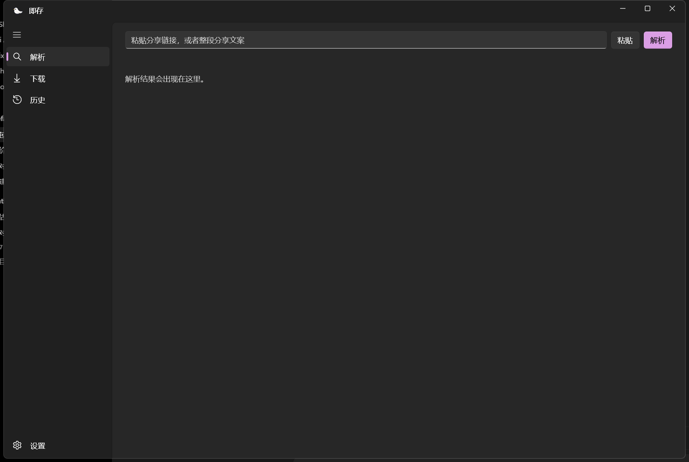
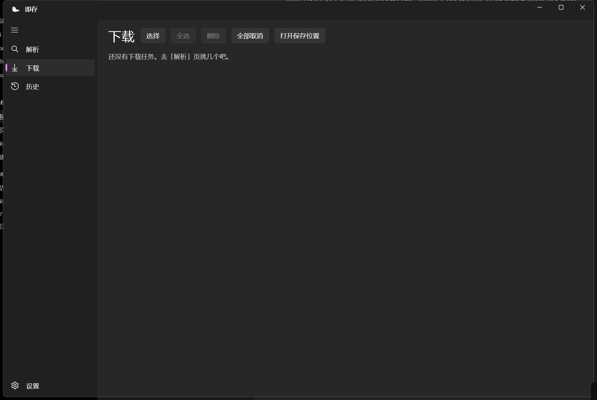

<p align="center">
  
</p>

<h1 align="center">即存 for Windows</h1>

<p align="center">
  <strong>粘贴分享链接，图片 / 视频 / 音频 / 文案一次拿到手。</strong>
</p>

<h3 align="center"><a href="https://github.com/dhvbjvvb/jicun-desktop/releases/latest">一键下载，装完即用。</a></h3>

<p align="center">
  Android 版「即存」的 Windows 桌面端：C# + WinUI 3，单工程、自包含打包 —— 目标机器不用装 .NET、不用装 Windows App SDK、不用装 VC++ 运行库，也不要管理员权限。
</p>

<p align="center"><sub>本程序只做「把你自己的链接解析成直链再下载」：不提供任何内容、不绕过付费或权限。请遵守各内容平台的服务条款与当地法律，使用风险自负。<br>本仓库与任何内容平台均无隶属、合作、授权或背书关系。</sub></p>

<p align="center">
  
</p>

<p align="center">
  <a href="https://github.com/dhvbjvvb/jicun-desktop/releases/latest"></a>
  <a href="https://github.com/dhvbjvvb/jicun-desktop/releases"></a>
  <a href="https://github.com/dhvbjvvb/jicun-desktop"></a>
  <a href="LICENSE"></a>
  
</p>

<a id="download"></a>

## 下载与安装

| 版本 | 下载 | 装法 |
| --- | --- | --- |
| **安装版**（推荐） | [Jicun-Setup-版本.exe](https://github.com/dhvbjvvb/jicun-desktop/releases/latest) | 双击运行安装器，点几下装好；**支持应用内自动更新** |
| 绿色版（解压即用） | [Jicun-win-x64.zip](https://github.com/dhvbjvvb/jicun-desktop/releases/latest) | 解压到任意文件夹，双击 `Jicun.exe`；**没有自动更新**，新版要自己下 |

- **系统要求**：64 位 Windows 10 1809（build 17763）或更高 / Windows 11。
- **不用装依赖**：.NET 运行时、Windows App SDK 运行时都在包里；VC++ 运行库也不需要。
- **不需要管理员权限**：按当前用户装在自己的目录里，不弹 UAC。
- 体积：安装器约 45 MB，装完约 168 MB；绿色包约 66 MB。
- 装好之后安装目录里有一份 [`使用说明.txt`](使用说明.txt)，可以顺手发给别人看。

> **安装包没有代码签名证书**：如果 Windows 弹了蓝色的「Windows 已保护你的电脑」，点「更多信息」→「仍要运行」就行 —— 不是病毒。（少数杀毒软件也可能误报，同样可以放心。）

## 主要功能

<table>
  <tr>
    <td width="50%" valign="top">
      <h3>链接解析</h3>
      <p>整段分享文案粘进来会自动挑出链接，Enter 直接解析，也可以点「粘贴」读剪贴板。一次解析最多等 25 秒，跑的时候按钮变「取消」—— 域名一条都不通时不用干等。</p>
    </td>
    <td width="50%" valign="top">
      <h3>真实清晰度</h3>
      <p>不显示上游那套「原画 / 高清」，而是读视频文件头拿到真实宽高，标成 <code>3210P</code> 这种能一眼比较的数字。</p>
    </td>
  </tr>
  <tr>
    <td width="50%" valign="top">
      <h3>预览</h3>
      <p>图片、视频、音频都能先看一眼再下：视频音频用系统播放器内核（原生 HLS + 自带传输控件），图片可缩放。</p>
    </td>
    <td width="50%" valign="top">
      <h3>下载够稳</h3>
      <p>3 路并发；单个文件大于 8 MB 自动切 4 段 Range 并行，每段最多重试 2 次；落盘后按文件头修正后缀，重名自动加序号；**关掉程序再打开能接着下**。</p>
    </td>
  </tr>
  <tr>
    <td width="50%" valign="top">
      <h3>音频标签</h3>
      <p>音频下载完自动写 ID3v2.4 / MP4 标签（标题、作者、专辑、封面），本地音乐库里也能认。</p>
    </td>
    <td width="50%" valign="top">
      <h3>三个保存位置</h3>
      <p>视频（含实况图）、图片、音频各存各的，都能自己选目录，默认落在 <code>视频\即存</code> / <code>图片\即存</code> / <code>音乐\即存</code>；下载页每张卡会告诉你它会存到哪。</p>
    </td>
  </tr>
  <tr>
    <td width="50%" valign="top">
      <h3>历史记录</h3>
      <p>最多留 200 条，同一个链接只留最新一条；点「重新解析」直接带着链接回解析页。清理时**只删记录，磁盘上已经下好的文件一个都不动**。</p>
    </td>
    <td width="50%" valign="top">
      <h3><a href="#update">自动更新</a> + <a href="#uninstall">一键卸载</a></h3>
      <p>装的是安装版就能在程序里直接更新（进度可见、校验指纹、装完自己重启）；卸载会帮你关掉正在运行的程序，并把本地数据一起清干净。</p>
    </td>
  </tr>
</table>

<p align="center">
  
</p>

<a id="update"></a>

## 自动更新

程序启动时会在后台查一次最新版，设置页也有「检查更新」手动查。

- **有新版本就弹一个公告窗口**：上面写这次改了什么（就是 GitHub 上那条 Release 的正文），底下「忽略」/「更新」。
- **「忽略」只忽略这一个版本**：以后出了更高的版本照样提示，手动点「检查更新」也照样能再看到它。
- **点「更新」**：下载安装器（有进度条和百分比）→ 校验文件指纹 → 静默安装 → 程序自己重启到新版。
- **指纹对不上会自动换一个下载源重试**，不会拿一个坏文件往你机器上装。
- **连不上 GitHub 时**会弹窗说明原因，并给一个**「去发布页」**按钮 —— 自己下载安装包就行。（国内直连 GitHub 时通时不通，所以默认会先走镜像。）
- **绿色版没有自动更新**（解压即用那份没法自己覆盖自己），弹窗里给的是「去下载」。

<a id="uninstall"></a>

## 卸载

三种方式，随便挑一个：

1. **设置 → 应用 → 已安装的应用**，搜「即存」→ 卸载。
2. **开始菜单 → 即存 → 「卸载 即存」**。
3. 直接运行安装目录里的 `unins000.exe`。

卸载流程：

- 如果程序正在运行，**先弹窗让你一键关掉它**（不关就卸载的话，文件被占用会留下删不掉的残留）。
- 然后弹一次确认：**设置、观看历史、下载记录和缓存会一起删掉**，删了恢复不了。
- **你自己下载到「视频 / 图片 / 音乐」里的文件一个都不动** —— 那是你的东西。
- 装的所有文件、开始菜单和桌面快捷方式、注册表里的卸载项都会清掉。

## 你的数据放在哪

全部在本机，不上传：

| 东西 | 位置 |
| --- | --- |
| 三个保存位置 | 设置页；`%LOCALAPPDATA%\Jicun\settings.json` |
| 解析历史 | `%LOCALAPPDATA%\Jicun\history.json`（最多 200 条） |
| 断点续传的分片 | `%LOCALAPPDATA%\Jicun\incomplete\` |
| 域名热更存档 | `%LOCALAPPDATA%\Jicun\server-config.json` |
| 忽略的版本 | `%LOCALAPPDATA%\Jicun\update-state.json` |
| 更新包缓存 | `%LOCALAPPDATA%\Jicun\update\`（装完或下次启动顺手清） |

卸载时上面这些会**一起删掉**。程序本身不收集也不回传你的使用数据；只有解析、下载、检查更新这几件事会联网。

## 命令行模式

同一个 exe，带参数就是无界面模式（批处理、排障用）：

| 命令 | 干什么 |
| --- | --- |
| `Jicun.exe` | 打开界面 |
| `Jicun.exe --parse <链接或整段分享文案>` | 只看解析结果，并打印走的是哪条路 |
| `Jicun.exe --download <url> [--name 文件名] [--dir 文件夹] [--kind video\|image\|audio]` | 下载一个文件 |
| `Jicun.exe --download <url> --audio --title 标题 --artist 歌手 --album 专辑 --cover <封面地址>` | 当音频下，落盘后补标签 |
| `Jicun.exe --selftest` | 自检（不联网、不开界面） |
| `Jicun.exe --hosts` / `--secrets` | 看域名热更结果 / 上游密钥配没配 |
| `Jicun.exe --help` | 用法 |

## 常见问题

**装的时候被 Windows 拦了？**
安装包没买代码签名证书。点「更多信息」→「仍要运行」；少数杀毒软件误报同理。

**支持哪些系统？**
64 位 Windows 10 1809（build 17763）及更高 / Windows 11。目前只出 x64 包。

**要不要先装 .NET 或运行库？**
不用。.NET 运行时和 Windows App SDK 运行时都打进去了，VC++ 运行库也不需要。

**更新装不上 / 卡住？**
更新失败会在窗口里写明原因。国内网络连 GitHub 不稳时，点弹窗里的「去发布页」自己下载安装包覆盖安装即可。绿色版请手动换包。

**解析失败？**
可能是链接所在平台改了接口，或当前网络到上游不通。可以把链接和报错发到 Issue 里。

**卸载后还有残留吗？**
正常卸载（先关掉程序）不会残留：程序文件、快捷方式、卸载项、本地数据都会清掉。只有「程序还在运行时强卸」这种情况才可能留下被占用的 DLL，那种情况请先退出程序再卸一次。

## 开发

```powershell
dotnet run                                  # 直接跑
.\pack.ps1 -Verify                          # 自包含打包 + zip，打完启动一次确认不是坏包
.\pack.ps1 -Installer -Verify               # 再编译 Inno Setup 安装器（需先装 Inno Setup 6）
.\release.ps1 -Version 1.0.6 -Notes "说明" -Publish   # 改版本号 → 打包 → 发 GitHub Release
```

架构、打包细节、更新链路、超时分层、配置项都在[开发说明](docs/开发说明.md)；CI 只做两件事：编译 + 跑 `--selftest`。

| 目标 | 入口 |
| --- | --- |
| 快速了解怎么装、怎么用 | 这份 README + [`使用说明.txt`](使用说明.txt) |
| 改代码 / 打包 / 发版 | [开发说明](docs/开发说明.md) |
| 提 Issue / 反馈 | [Issues](https://github.com/dhvbjvvb/jicun-desktop/issues) |

## License

本项目遵循 [MIT License](LICENSE)。

> 本项目完全免费开源。如果有人向你收费出售此软件，请拒绝。
>
> 本程序只提供「解析你自己有权访问的链接并下载」这一技术能力，不提供任何内容、不破解任何权限或付费墙；请遵守各内容平台的服务条款与当地法律，使用风险自负。
>
> 本仓库与任何内容平台不存在隶属、合作、授权或背书关系。

## Star History

<a href="https://www.star-history.com/?repos=dhvbjvvb%2Fjicun-desktop&amp;type=date&amp;legend=top-left">
  <picture>
    <source media="(prefers-color-scheme: dark)" srcset="https://api.star-history.com/chart?repos=dhvbjvvb/jicun-desktop&amp;type=date&amp;theme=dark&amp;legend=top-left">
    <source media="(prefers-color-scheme: light)" srcset="https://api.star-history.com/chart?repos=dhvbjvvb/jicun-desktop&amp;type=date&amp;legend=top-left">
    
  </picture>
</a>
